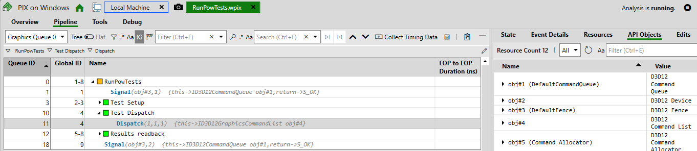
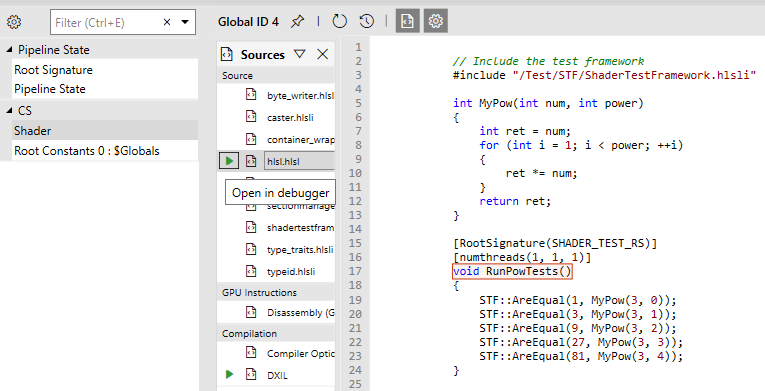
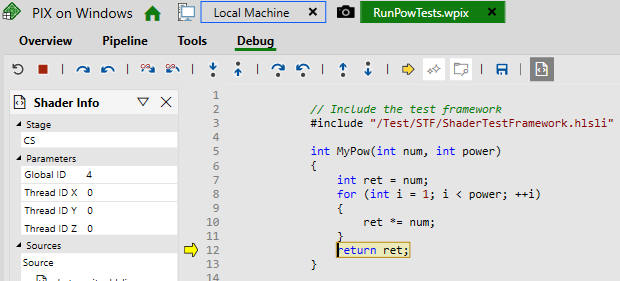
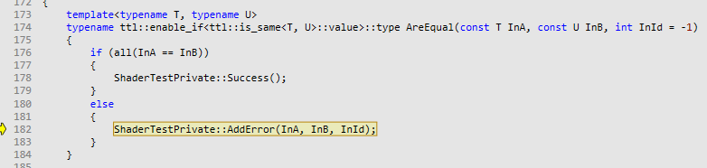

<a id="top"></a>
# Tutorial

**Contents**<br>
[Requirements](#requirements)<br>
[Optional Requirements](#optional-requirements)<br>
[Getting ShaderTestFramework](#getting-shader-test-framework)<br>
[Writing tests](#writing-tests)<br>

## Requirements

1. Windows 10 Version 1909 (OS build 18363.1350) or greater - This is due to a dependency on the [DirectX Agility SDK](https://devblogs.microsoft.com/directx/gettingstarted-dx12agility/)
2. Visual Studio 2022 17.2 - This is due to the project making use of several C++23 features e.g. [Deducing This](https://devblogs.microsoft.com/cppblog/cpp23-deducing-this/)
3. [CMake 3.25](https://cmake.org/download/) - Shader Test Framework's cmake scripts make use of [PROPAGATE](https://cmake.org/cmake/help/latest/command/return.html) which came in 3.25 
4. A working internet connection on first build - This is due to the cmake scripts downloading all of the dependencies of the project.

## Optional Requirements

1. [PIX on Windows](https://devblogs.microsoft.com/pix/download/) - This is not required. However, it is recommended. The framework is able to take pix captures of your test runs. This will allow you to be able to debug your shader code. Very useful for tracking down the cause of a failing test.
2. A testing framework - [Catch2](https://github.com/catchorg/Catch2) is the recommended framework and all examples will use it. However, most other frameworks should be ok. NOTE: [MS Unit Testing Framework](https://learn.microsoft.com/en-us/visualstudio/test/writing-unit-tests-for-c-cpp?view=vs-2022) is not likely to work. Shader Test Framework depends on being able to copy dlls (e.g the DirectX Agility SDK dlls) to the location of the executable being run. Microsofts testing framework does not produce an exe. It produces a dll which is picked up by the testing framework's exe which is located in the installation of Visual Studio. 

## Getting Shader Test Framework

The installation guide can be found [here](InstallationGuide.md)

## Writing tests

All of the following examples will be using [Catch2](https://github.com/catchorg/Catch2) as its testing framework

### A Minimal Example
Let's start with a really simple example ([code](../examples/EX0_MinimalShaderTest/MinimalShaderTest.cpp)). This shader test will pass

```c++
SCENARIO("MinimalShaderTestExample")
{
    ShaderTestFixture::Desc desc{};
    desc.Source = std::string{
        R"(
            // Include the test framework
            #include "/Test/STF/ShaderTestFramework.hlsli"

            [RootSignature(SHADER_TEST_RS)]
            [numthreads(1, 1, 1)]
            void MinimalTestEntryFunction()
            {
                STF::AreEqual(42, 42);
            }
        )"
    };
    ShaderTestFixture fixture(std::move(desc));
    REQUIRE(fixture.RunTest("MinimalTestEntryFunction", 1, 1, 1));
}
```
And you will get an output like

```
All tests passed (1 assertion in 1 test case)
```

This demonstrates how we can run a shader test from C++ by creating a `ShaderTestFixture` and then calling `ShaderTestFixture::RunTest`. The HLSL code under test can be provided as a `std::string` or it can be provided by providing a `std::filesystem::path`. `ShaderTestFixture::RunTest` takes the name of the entry function to run and the dispatch configuration. So this test will dispatch a single thread group.

If we change the assert to be `STF::NotEqual` then our test will fail and will have an output like the following
```
MinimalShaderTest.cpp(34): FAILED:
  REQUIRE( fixture.RunTest("MinimalTestEntryFunction", 1, 1, 1) )
with expansion:
  There were 0 successful asserts and 1 failed assertions
  Assert 0:
  Data 1: 42
  Data 2: 2

===============================================================================
test cases: 1 | 1 failed
assertions: 1 | 1 failed
```

ShaderTestFramework provides assert failure formatting for all native types provided by HLSL. Above, we can see that the framework provides the left and right arguments to the assert. If we change the asserts to be comparing two float2s like so:

```c++
#include "/Test/STF/ShaderTestFramework.hlsli"

[RootSignature(SHADER_TEST_RS)]
[numthreads(1, 1, 1)]
void MinimalTestEntryFunction()
{
    STF::AreEqual(float2(42.0, 2.0), float2(0.0, 3.2));
}
```
we will get a similar assert failure report:

```
MinimalShaderTest.cpp(34): FAILED:
  REQUIRE( fixture.RunTest("MinimalTestEntryFunction", 1, 1, 1) )
with expansion:
  There were 0 successful asserts and 1 failed assertions
  Assert 0:
  Data 1: (42, 2)
  Data 2: (0, 3.2)

===============================================================================
test cases: 1 | 1 failed
assertions: 1 | 1 failed
```

### A Worked Example

Let's have a look at ([code](../examples/EX1_FailingPowTests/PowTests.cpp)) and also ensure that you have set up PIX by following the [Setting Up PIX](SettingUpPIX.md) guide.

```c++
SCENARIO("PowTests")
{
    ShaderTestFixture::Desc desc{};
    desc.Source = std::string{
        R"(
            #include "/Test/STF/ShaderTestFramework.hlsli"

            int MyPow(int num, int power)
            {
                int ret = num;
                for (int i = 1; i < power; ++i)
                {
                    ret *= num;
                }
                return ret;
            }

            [RootSignature(SHADER_TEST_RS)]
            [numthreads(1, 1, 1)]
            void RunPowTests()
            {
                STF::AreEqual(1, MyPow(3, 0));
                STF::AreEqual(3, MyPow(3, 1));
                STF::AreEqual(9, MyPow(3, 2));
                STF::AreEqual(27, MyPow(3, 3));
                STF::AreEqual(81, MyPow(3, 4));
            }
        )"
    };
    ShaderTestFixture fixture(std::move(desc));
    REQUIRE(fixture.RunTest("RunPowTests", 1, 1, 1));
}
```

If we run this example we will get the following output
```
PowTests.cpp(48): FAILED:
  REQUIRE( fixture.RunTest("RunPowTests", 1, 1, 1) )
with expansion:
  There were 4 successful asserts and 1 failed assertions
  Assert 0:
  Data 1: 1
  Data 2: 3

===============================================================================
test cases: 1 | 1 failed
assertions: 1 | 1 failed
```

We have 5 asserts. 4 of which passed. 1 failed. And the one that failed was the one that had 1 as the left argument and 3 as the right argument. This is the first assert. The fix for this is fairly trivial however, let's pretend that it is not. We can debug this with [PIX on Windows](https://devblogs.microsoft.com/pix/download/).
To take a capture of a test that is run we can call `ShaderTestFixture::TakeCapture` prior to running a test. So we can amend the example to look like this

```c++
SCENARIO("PowTests")
{
    ShaderTestFixture::Desc desc{};
    desc.Source = std::string{
        R"(
            #include "/Test/STF/ShaderTestFramework.hlsli"

            int MyPow(int num, int power)
            {
                int ret = num;
                for (int i = 1; i < power; ++i)
                {
                    ret *= num;
                }
                return ret;
            }

            [RootSignature(SHADER_TEST_RS)]
            [numthreads(1, 1, 1)]
            void RunPowTests()
            {
                STF::AreEqual(1, MyPow(3, 0));
                STF::AreEqual(3, MyPow(3, 1));
                STF::AreEqual(9, MyPow(3, 2));
                STF::AreEqual(27, MyPow(3, 3));
                STF::AreEqual(81, MyPow(3, 4));
            }
        )"
    };
    ShaderTestFixture fixture(std::move(desc));
    fixture.TakeCapture();
    REQUIRE(fixture.RunTest("RunPowTests", 1, 1, 1));
```

And then run it. There will now be a `Captures` directory in the same directory that your executable lives. Inside it there will be a `.wpix` file that we can open with PIX. From here we can click Analyze at the top and we will have a view like this 



Look down and we will be able to select the shader to debug 



Click on the green debugger symbol as shown above. This will open the debugger and we can start stepping through our code and we can see that the issue is that our loop doesn't execute



If we keep stepping into the code we will find that due to this we end up adding an error because the assert failed



This is what we would expect. Now we now how to fix the problem. We can go back to our project and make the change

```c++
int MyPow(int num, int power)
{
    int ret = 1;
    for (int i = 0; i < power; ++i)
    {
        ret *= num;
    }
    return ret;
}
```

And now we can run our tests again and see them passing

