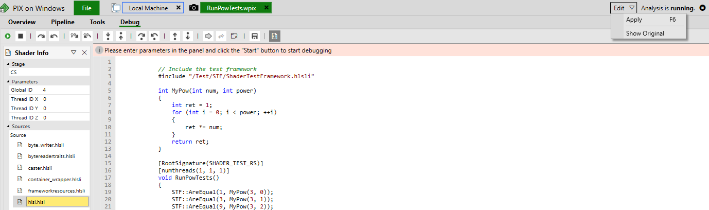
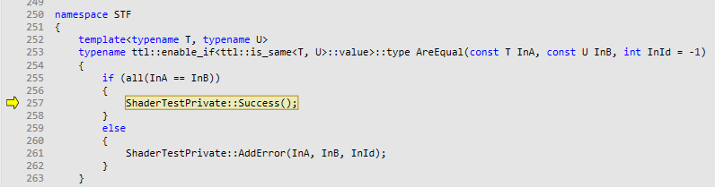

[Reference](./ShaderTestFramework.md)

# Tutorial

**Contents**<br>
1. [Requirements](#requirements)
2. [Optional Requirements](#optional-requirements)
3. [Getting ShaderTestFramework](#getting-shader-test-framework)
4. [Writing tests](#writing-tests)<br>
 a. [A Minimal Example](#a-minimal-example)<br>
 b. [A Worked Example](#a-worked-example)<br>
 c. [What did we do here](#what-did-we-do-here)<br>
 d. [A note on Edit and Continue](#a-note-on-edit-and-continue)
5. [Working with Shader Files using Virtual Shader Directories](#working-with-shader-files-using-virtual-shader-directories)
6. [SCENARIOs and SECTIONs](#scenarios-and-sections)
7. [Assertions](#assertions)
8. [Compile Time Tests](#compile-time-tests)

## Requirements

1. Windows 10 Version 1909 (OS build 18363.1350) or greater - This is due to a dependency on the [DirectX Agility SDK](https://devblogs.microsoft.com/directx/gettingstarted-dx12agility/)
2. Visual Studio 2022 17.7 - This is due to the project making use of several C++23 features e.g. [std::views::enumerate](https://en.cppreference.com/w/cpp/ranges/enumerate_view)
3. [CMake 3.26](https://cmake.org/download/) - Shader Test Framework's CMake scripts make use of [CMAKE_VS_VERSION_BUILD_NUMBER](https://cmake.org/cmake/help/latest/variable/CMAKE_VS_VERSION_BUILD_NUMBER.html) which came in 3.26 
4. A working internet connection on the first build - This is due to the CMake scripts downloading all of the dependencies of the project.

## Optional Requirements

1. [PIX on Windows](https://devblogs.microsoft.com/pix/download/) - This is not required. However, it is recommended. The framework can take pix captures of your test runs. This will allow you to be able to debug your shader code. Very useful for tracking down the cause of a failing test.
2. A testing framework - [Catch2](https://github.com/catchorg/Catch2) is the recommended framework and all examples will use it. However, most other frameworks should be ok. NOTE: [MS Unit Testing Framework](https://learn.microsoft.com/en-us/visualstudio/test/writing-unit-tests-for-c-cpp?view=vs-2022) is not likely to work. Shader Test Framework depends on being able to copy DLLs (e.g. the DirectX Agility SDK DLLs) to the location of the executable being run. Microsoft's testing framework does not produce an exe. It produces a DLL which is picked up by the testing framework's exe which is located in the installation of Visual Studio. 

## Getting Shader Test Framework

The installation guide can be found [here](./InstallationGuide.md)

## Writing tests

All of the following examples will be using [Catch2](https://github.com/catchorg/Catch2) as its testing framework

### A Minimal Example
Let's start with a really simple example ([code](../examples/Ex0_MinimalShaderTest/MinimalShaderTest.cpp)). This shader test will pass

```c++
SCENARIO("MinimalShaderTestExample")
{
    stf::ShaderTestFixture fixture(stf::ShaderTestFixture::FixtureDesc{});
    REQUIRE(fixture.RunTest
        (
            stf::ShaderTestFixture::RuntimeTestDesc
            {
                .CompilationEnv
                {
                    .Source = std::string
                    {
                        R"(
                            // Include the test framework
                            #include "/Test/STF/ShaderTestFramework.hlsli"

                            [RootSignature(SHADER_TEST_RS)]
                            [numthreads(1, 1, 1)]
                            void MinimalTestEntryFunction()
                            {
                                ASSERT(AreEqual, 42, 42);
                            }
                        )"
                    }
                },
                .TestName = "MinimalTestEntryFunction",
                .ThreadGroupCount{ 1, 1, 1}
            }
        )
    );
}
```
And you will get an output like

```
All tests passed (1 assertion in 1 test case)
```

This demonstrates how we can run a shader test from C++ by creating an `stf::ShaderTestFixture` and then calling `ShaderTestFixture::RunTest`. `ShaderTestFixture::RunTest` takes an `stf::ShaderTestFixture::RuntimeTestDesc` which describes the parameters of the test. The parameters that we need to specify in the minimal test case are:

1. `Source` - Can be either a `std::string` which contains the HLSL source code OR a `std::filesystem::path` which points to a file which contains the HLSL code that we want to compile.
2. `TestName` - This is the name of the entry function of the test shader.
3. `ThreadGroupCount` - The thread group dispatch configuration.

In this example we are providing our HLSL code as a `std::string` and the entry function of the test is `MinimalTestEntryFunction`, and we are only dispatching a single thread group to run the test.

If we change the assert to be `stf::NotEqual` then our test will fail and will have an output like the following:
```
MinimalShaderTest.cpp(34): FAILED:
  REQUIRE( fixture.RunTest("MinimalTestEntryFunction", 1, 1, 1) )
with expansion:
  There were 0 successful asserts and 1 failed assertions
  Assert 0:
  Data 1: 42
  Data 2: 2

===============================================================================
test cases: 1 | 1 failed
assertions: 1 | 1 failed
```

ShaderTestFramework provides assert failure formatting for all native types provided by HLSL. Above, we can see that the framework provides the left and right arguments to the assert. If we change the asserts to compare two float2s like so:

```c++
#include "/Test/STF/ShaderTestFramework.hlsli"

[numthreads(1, 1, 1)]
void MinimalTestEntryFunction()
{
    ASSERT(AreEqual, float2(42.0, 2.0), float2(0.0, 3.2));
}
```
we will get a similar assert failure report:

```
MinimalShaderTest.cpp(34): FAILED:
  REQUIRE( fixture.RunTest("MinimalTestEntryFunction", 1, 1, 1) )
with expansion:
  There were 0 successful asserts and 1 failed assertions
  Assert 0:
  Data 1: (42, 2)
  Data 2: (0, 3.2)

===============================================================================
test cases: 1 | 1 failed
assertions: 1 | 1 failed
```

### A Worked Example

Let's have a look at ([code](../examples/Ex1_FailingPowTests/PowTests.cpp)) and also ensure that you have set up PIX by following the [Setting Up PIX](SettingUpPIX.md) guide.

```c++
SCENARIO("PowTests")
{
    stf::ShaderTestFixture fixture(stf::ShaderTestFixture::FixtureDesc{});
    REQUIRE(fixture.RunTest(
        stf::ShaderTestFixture::RuntimeTestDesc
        {
            .CompilationEnv
            {
                .Source = std::string{
                    R"(
                        // Include the test framework
                        #include "/Test/STF/ShaderTestFramework.hlsli"

                        int MyPow(int num, int power)
                        {
                            int ret = num;
                            for (int i = 1; i < power; ++i)
                            {
                                ret *= num;
                            }
                            return ret;
                        }

                        [RootSignature(SHADER_TEST_RS)]
                        [numthreads(1, 1, 1)]
                        void RunPowTests()
                        {
                            ASSERT(AreEqual, 1, MyPow(3, 0));
                            ASSERT(AreEqual, 3, MyPow(3, 1));
                            ASSERT(AreEqual, 9, MyPow(3, 2));
                            ASSERT(AreEqual, 27, MyPow(3, 3));
                            ASSERT(AreEqual, 81, MyPow(3, 4));
                        }
                    )"
                }
            },
            .TestName = "RunPowTests",
            .ThreadGroupCount{1, 1, 1},
        })
    );
}
```

If we run this example we will get the following output
```
PowTests.cpp(48): FAILED:
  REQUIRE( fixture.RunTest("RunPowTests", 1, 1, 1) )
with expansion:
  There were 4 successful asserts and 1 failed assertions
  Assert 0:
  Data 1: 1
  Data 2: 3

===============================================================================
test cases: 1 | 1 failed
assertions: 1 | 1 failed
```

We have 5 asserts. 4 of which passed. 1 failed. And the one that failed was the one that had 1 as the left argument and 3 as the right argument. This is the first assertion. The fix for this is fairly trivial however, let's pretend it is not. We can debug this with [PIX on Windows](https://devblogs.microsoft.com/pix/download/).

To take a capture of a test that is run we can call `ShaderTestFixture::TakeCapture` before running a test. So, we can amend the example to look like this

To take a capture of a test we have to do two things:
1. Enable GPU capturing capabilities when constructing the `stf::ShaderTestFixture`
2. Set the `GPUCaptureMode` in the `stf::ShaderTestFixture::RuntimeTestDesc` when calling `ShaderTestFixture::RunTest`

Making these two changes our example now looks like this:

```c++
SCENARIO("PowTests")
{
    stf::ShaderTestFixture fixture(
        stf::ShaderTestFixture::FixtureDesc
        {
            .GPUDeviceParams
            {
                .EnableGPUCapture = true
            }
        }
    );

    REQUIRE(fixture.RunTest(
        stf::ShaderTestFixture::RuntimeTestDesc
        {
            .CompilationEnv
            {
                .Source = std::string{
                    R"(
                        // Include the test framework
                        #include "/Test/STF/ShaderTestFramework.hlsli"

                        int MyPow(int num, int power)
                        {
                            int ret = num;
                            for (int i = 1; i < power; ++i)
                            {
                                ret *= num;
                            }
                            return ret;
                        }

                        [RootSignature(SHADER_TEST_RS)]
                        [numthreads(1, 1, 1)]
                        void RunPowTests()
                        {
                            //ASSERT(AreEqual, 1, MyPow(3, 0));
                            ASSERT(AreEqual, 3, MyPow(3, 1));
                            ASSERT(AreEqual, 9, MyPow(3, 2));
                            ASSERT(AreEqual, 27, MyPow(3, 3));
                            ASSERT(AreEqual, 81, MyPow(3, 4));
                        }
                    )"
                }
            },
            .TestName = "RunPowTests",
            .ThreadGroupCount{1, 1, 1},
            .GPUCaptureMode = stf::ShaderTestFixture::EGPUCaptureMode::On
        })
    );
}
```

NOTE: you can also set the `GPUCaptureMode` to be `stf::ShaderTestFixture::EGPUCaptureMode::CaptureOnFailure`. This will run your test without capturing it. If the test passes, no GPU capture is created. If the test fails, the fixture will run the test again while capturing it.

Now we run this example again. There will now be a `Captures` directory in the same directory that your executable lives. Inside it, there will be a `.wpix` file that we can open with PIX. From here we can click "Analyze" at the top and we will have a view like this 


Look down and we will be able to select the shader to debug 


Click on the green debugger symbol as shown above. This will open the debugger and we can start stepping through our code. We can now see that the issue is that our loop doesn't execute


If we keep stepping into the code we will find that due to this we end up adding an error because the assert failed


This is what we would expect. Now we know how to fix the problem. From here we can use "Edit And Continue". Edit And Continue is a feature in PIX which allows you to make shader changes from withint a capture, recompile the shader, and then rerun the PIX capture as if the original capture had those shader changes. So within PIX we can make the following change to the `MyPow` function:

```c++
int MyPow(int num, int power)
{
    int ret = 1;
    for (int i = 0; i < power; ++i)
    {
        ret *= num;
    }
    return ret;
}
```

When we make this change in PIX we should be able to apply the changes using `F6` or hitting the "apply" button like so:



Once we hit apply, and re-start stepping through the test, we can now see that execution takes us to the success part of the shader:



Now we have confirmed that this is the fix to make, we can apply the change to our actual shader and watch our test go green!

### What did we do here?

This was a fairly simple exercise in the following:
- Writing a simple test for some HLSL code
- Determining which assert failed using the test results output
- Taking a PIX capture of the failing test.
- Using shader debugging in PIX to step through the shader to figure out what went wrong
- Fixed the bug in PIX
- Used Edit And Continue to confirm that the fix worked

### A note on Edit and Continue

There is currently a bug in PIX Edit and Continue which means that PIX will fail to recompile shaders when `#pragma once` is used in shader header files. For this reason `STF` uses include guards. To ensure that Edit and Continue can be used in your projects, prefer include guards over `#pragma once`

## Working with Shader Files using Virtual Shader Directories

Up until now, we have been writing HLSL code directly in our C++ in strings. However, this does not scale and is not practical. We do not want to have to recompile our test suite whenever we are simply iterating on our HLSL code. Therefore it is recommended that users of STF write their HLSL code in HLSL files, and use STF's asset dependency and virtual shader directories facilities. An example of how this can be done is in ([Ex2_VirtualShaderDirectories](../examples/Ex2_VirtualShaderPaths)) and a much more in-depth tutorial on this part of the framework can be found in [VirtualShaderDirectories](./STF/VirtualShaderDirectories.md).

## SCENARIOs and SECTIONs

Shader Test Framework provides a mechanism to help test writers, write tests that both minimise code repetition and also ensure that their tests are easy to reason about and follow. They are very similar to [Catch2](https://github.com/catchorg/Catch2/)s `TEST_CASE`s and `SECTION`s, and look like the following:
```c++
[numthreads(1, 1, 1)]
void OptionalTestsWithScenariosAndSections()
{
        SCENARIO("GIVEN An Optional that is reset")
    {
        Optional<int> opt;
        opt.Reset();

        SECTION("THEN IsValid returns false")
        {
            ASSERT(IsFalse, opt.IsValid);
        }

        SECTION("THEN GetOrDefault returns default value")
        {
            const int expectedValue = 42;
            ASSERT(AreEqual, expectedValue, opt.GetOrDefault(expectedValue));
        }

        SECTION("WHEN value is set")
        {
            const int expectedValue = 42;
            opt.Set(expectedValue);

            SECTION("THEN IsValid returns true")
            {
                ASSERT(IsTrue, opt.IsValid);
            }

            SECTION("THEN GetOrDefault returns set value")
            {
                const int defaultValue = 24;
                ASSERT(AreEqual,  expectedValue, opt.GetOrDefault(defaultValue));
            }
        }
    }
}
```

Please refer to [Scenarios and Sections](./STF/ScenariosAndSections.md) for more details on how they work, and the rationale behind them.

## Assertions

To read more about the other assertion features that Shader Test Framework provides, the [Asserts](./STF/Asserts.md) documentation is the place to go.

## Compile Time Tests

With HLSL2021, we might find ourselves writing template metafunctions that we want to test. Since templates are evaluated at compile time, then it would be a waste to write run-time tests for these functions. Instead, we can use `_Static_assert` to write Compile Time Tests. The following docs should help to better understand how to write these types of tests:
1. [Compile Time Tests](./STF/CompileTimeTests.md)
2. [`_Static_assert`](./TTL/StaticAssert.md)

---

[Top](#tutorial)

[Home](../README.md)
